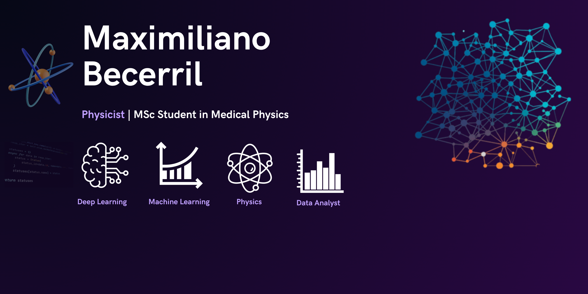

   

  # Welcolme to my Github profile :)

 

Medical Physics MSc student, researcher, and ML/DL enthusiast exploring Machine Learning, Deep Learning, Medical AI, and scientific data analysis. Interested in computational research, data-driven modeling, and applying intelligent methods to medicine, physics, and complex real-world problems

## 🧠 Machine Learning & Deep Learning

## 📊 Data Science & Scientific Computing

## 🖼️ Computer Vision & Image Processing

## 💻 Development & Programming Tools

## 🗄️ Databases

## 📑 Scientific Writing & Productivity

## 🔬 Research & Data Platforms

>

**MaxBecerril1/MaxBecerril1** is a ✨ _special_ ✨ repository because its `README.md` (this file) appears on your GitHub profile.

Here are some ideas to get you started:

- 🔭 I’m currently working on ...
- 🌱 I’m currently learning ...
- 👯 I’m looking to collaborate on ...
- 🤔 I’m looking for help with ...
- 💬 Ask me about ...
- 📫 How to reach me: ...
- 😄 Pronouns: ...
- ⚡ Fun fact: ...
-->
